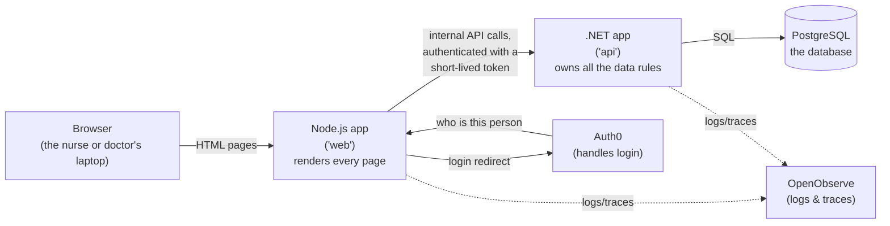
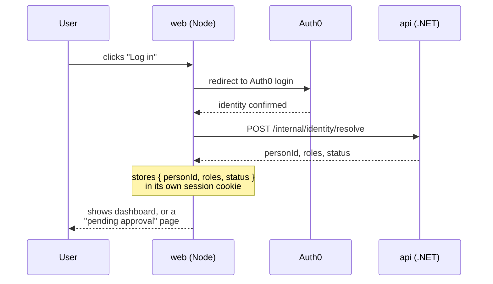
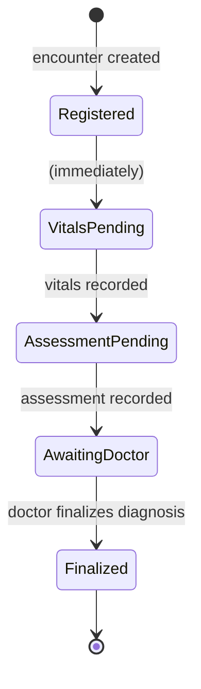

# CloudCure
Rewritten and modernized [CloudCure](https://github.com/CloudCure/CloudCure), a project I worked on with a team in 2021.

CloudCure is a small clinic-management app. A nurse checks a patient in, records their
vitals and history, a doctor reviews the case and finalizes a diagnosis, and the whole
visit is stored as a structured record. Staff sign in with Auth0; patients don't sign in
at all — they're records that staff manage, not app users.

This document explains how the codebase is put together. If you're new to the project,
read this all the way through once before touching code — it'll save you time later.

---

## The big picture

CloudCure is two separate programs talking to each other, plus a database:



**Why two programs instead of one?** Each one has a single job:

- **`services/web`** (Node.js + Express + TypeScript) is the only thing the browser ever
  talks to. It renders the actual HTML pages using [htmx](https://htmx.org/) for
  interactivity, and it's the only piece that knows about Auth0 — it owns the login
  flow and the session cookie. It has no direct connection to the database at all.
- **`services/api`** (.NET 10 + Entity Framework Core) owns the database and every rule
  about who's allowed to do what. It has no idea Auth0 exists — it just checks a token
  on every request and enforces permissions from there.

They talk to each other over plain HTTP, on a private network that isn't reachable from
outside Docker. Every call from `web` to `api` carries a short-lived (60-second) signed
token identifying who's making the request and what role they hold — minted fresh by
`web` for each request, and verified by `api` before it does anything.

---

## Signing in and getting permission to do things

Patients never sign in — a patient is just a record a staff member creates and edits.
Only staff (nurses, doctors, admins) authenticate, and the process has two separate
concerns that are easy to conflate but are kept strictly apart here:

1. **Who are you?** — answered by Auth0. `services/web` redirects to Auth0's login
   page, gets back proof of identity, and stores a session.
2. **What are you allowed to do?** — answered entirely by `services/api`, based on a
   role it looks up in its own database. Auth0 never gets a vote here.

The first time someone logs in, `services/web` calls an internal endpoint on
`services/api` (`POST /internal/identity/resolve`) with the bare identity Auth0 handed
back. If it's a new person, `services/api` creates a record for them with a role of
`Pending` and nothing else — **the role is never something the client can request or
set**. An existing admin has to open the pending-approvals page and explicitly grant a
real role (`Nurse`, `Doctor`, or `Admin`) before that person can do anything besides
see a "waiting for approval" screen.



There's a bootstrapping wrinkle worth knowing: the very first admin account has no one
to approve them, since approving someone requires an existing admin. Right now that's
handled by hand — directly updating that one person's role in the database — see
[STARTUP.md](STARTUP.md). This is a known gap, not an oversight.

---

## A visit, start to finish

The core workflow — an **encounter** — moves through a fixed sequence of stages, and
`services/api` enforces the order server-side. You cannot record an assessment before
vitals exist; the API rejects it.



Each transition is a specific method on `EncounterWorkflowService`
(`services/api/src/CloudCure.Application/Encounters/EncounterWorkflowService.cs`), and
each one double-checks the encounter is in exactly the stage it expects before doing
anything. This is the one piece of business logic most worth reading before you change
anything encounter-related.

---

## What's in the database

Every table is explained, with diagrams, in [docs/ERD.md](docs/ERD.md). The short
version: a `people` table holds anyone the system knows about, and separate
`patients`/`staff_members` tables mark which role(s) a person plays. Clinical data
(vitals, assessments, diagnoses) hangs off `encounters`. Screening questionnaires
(like the COVID-19 check-in) are entirely data-driven — the questions themselves are
rows in a table, not hardcoded fields. And every meaningful write to the database
automatically produces a row in `audit_log`, in the same transaction as the change
itself.

---

## Project layout

```
  docker-compose.yml            # the whole stack: postgres, api, web, observability
  docker-compose.override.yml   # local-dev extras (hot reload, exposed ports)
  .env.example                  # copy to .env and fill in real values
  docs/
    ERD.md                      # the database, diagrammed and explained
  services/
    api/                        # .NET 10 — the JSON API and all the data rules
      src/
        CloudCure.Domain/           # entities, enums, the encounter state machine
        CloudCure.Infrastructure/   # EF Core, the database schema, the audit trail
        CloudCure.Application/      # the actual business logic (services)
        CloudCure.Api/              # HTTP endpoints, auth wiring, request/response shapes
      test/                         # one test project per src project above
    web/                         # Node.js — every page the browser sees
      src/
        auth/          # Auth0 login flow, session handling, internal token minting
        routes/        # one file per group of pages (patients, encounters, staff...)
        views/         # the actual HTML templates (Nunjucks + htmx)
        apiClient/     # the only code allowed to call services/api
        middleware/    # route guards (must be logged in, must hold a given role)
        security/      # CSRF protection
      test/            # Jest + Supertest
```

---

## Running it locally

See [STARTUP.md](STARTUP.md) for the full walkthrough (Docker setup, Auth0
configuration, running migrations, and creating your first account).

---

## Tests

Both sides of the app are tested against real infrastructure, not mocks — the .NET
tests spin up a real, temporary PostgreSQL container per test class
([Testcontainers](https://testcontainers.com/)), and integration tests exercise the
actual HTTP pipeline through `WebApplicationFactory`.

```bash
# .NET — from v2/services/api
dotnet test

# Node — from v2/services/web
npm test
```

## Known gaps

- **No automated browser tests yet.** A full Playwright suite that drives a real login
  through Auth0 needs a real Auth0 test-tenant, which this environment doesn't have.
  The Node-side logic is covered thoroughly by Jest + Supertest instead.
- **No Postman collection yet** for manually exercising the API.
- **First-admin bootstrapping is manual** — see above.
