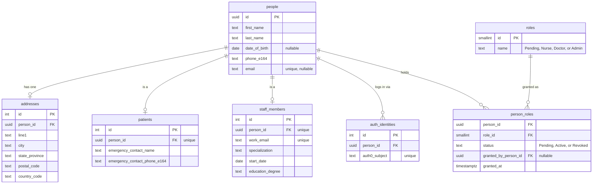
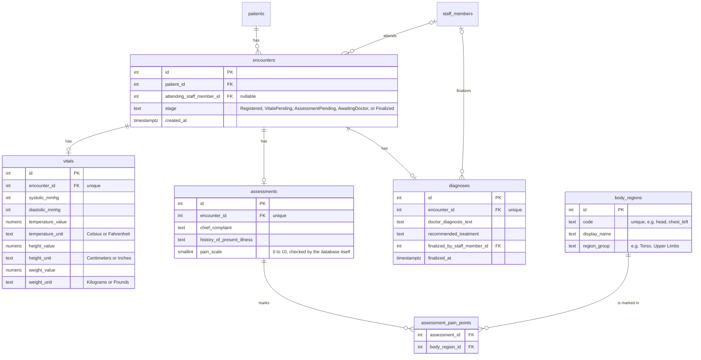
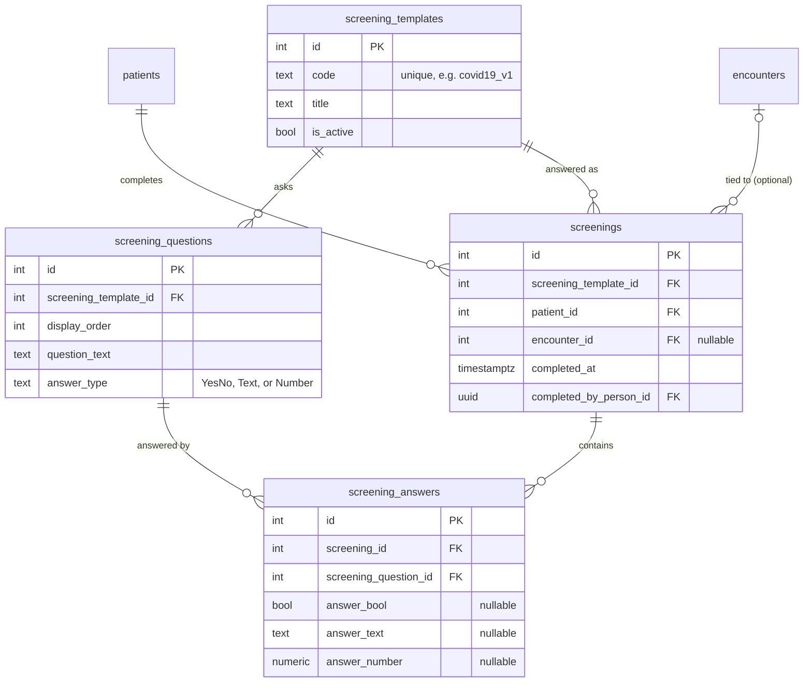
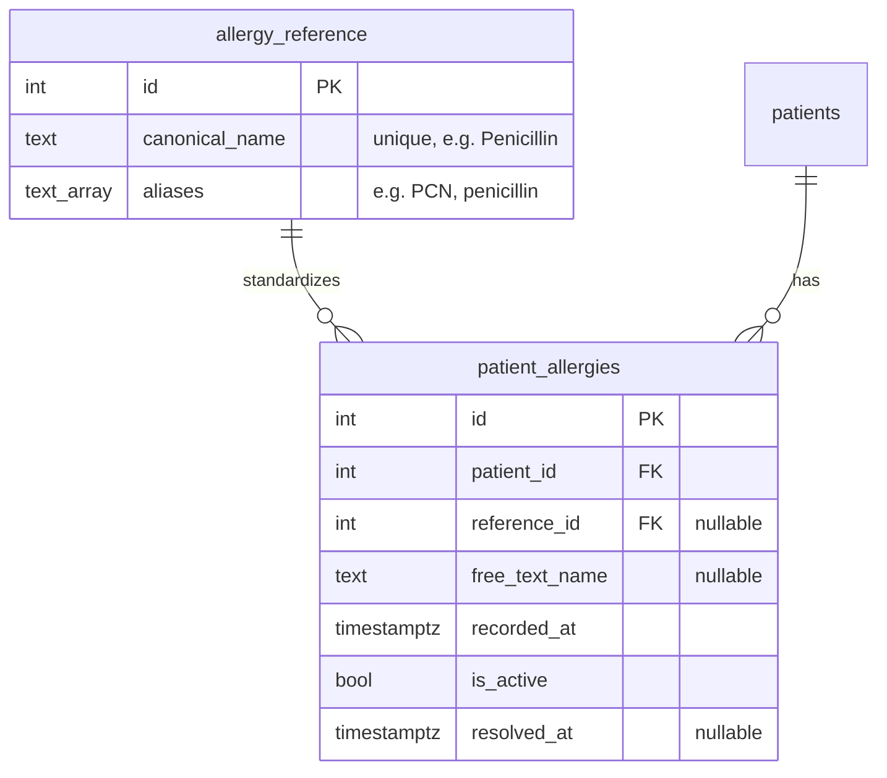
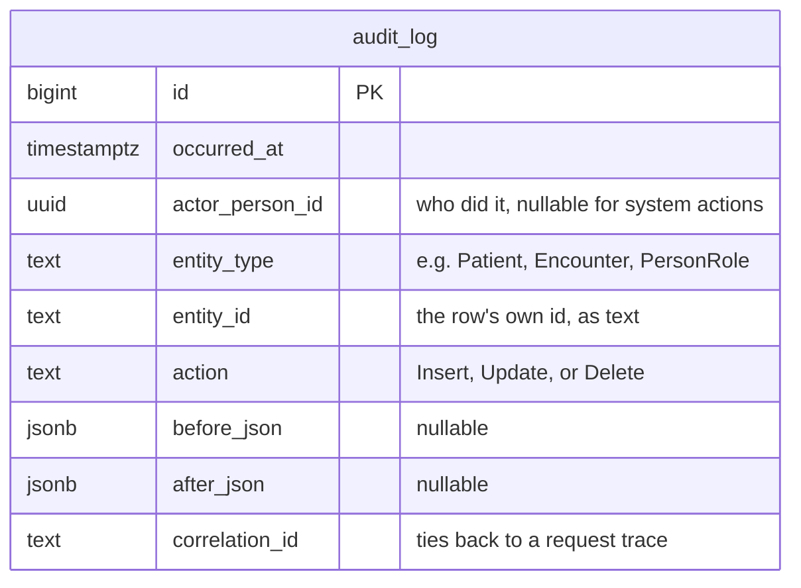

# CloudCure Database — Entity Relationship Diagram

This document maps out every piece of information CloudCure stores and how those
pieces connect to each other. It's organized by area of the app, with a diagram for
each, followed by an explanation of why it's modeled the way it is.

The database is **PostgreSQL**. Every table below was created by an EF Core migration
committed to this repo, under
`services/api/src/CloudCure.Infrastructure/Data/Migrations/`. If you want the exact,
current column list and constraints for any table, that migration history — or the
matching file in `Data/Configurations/` — is the ground truth, not this document.

---

## 1. People, patients, and staff

A **person** is any human the system knows about — name, date of birth, phone, email.
Whether that person is a *patient*, a *staff member*, or both is decided by which of
two thin tables also has a row pointing back at them, rather than by a flag or a type
column on `people` itself.

**Why it's shaped this way:**

- **`person_roles` is a list, not a single column on `people`.** A person can hold more
  than one role over time, each with its own status and its own record of who granted
  it and when — so the history of "who approved this person, and as what" is never
  lost.
- **Nobody can hand themselves a role.** When someone logs in for the first time, they
  get a `person_roles` row with `status = Pending` and no real role yet. The *only* way
  that ever flips to `Active` is an admin approving them through
  `POST /api/staff/pending-approvals/{id}/approve` — it's never something a person can
  submit about themselves.
- **`date_of_birth` is nullable.** A staff account is created automatically the moment
  someone logs in via Auth0, before they've filled out any form — and Auth0 never hands
  us a birthdate, so the column has to allow "not known yet."

---

## 2. A clinical encounter (one visit)

An **encounter** is one visit — from check-in to a doctor signing off. It moves through
a fixed set of stages in order, and the API rejects any attempt to skip one (recording
an assessment before vitals exist returns an error rather than a half-finished record).

**Why it's shaped this way:**

- **`stage` is the whole workflow, in one column.** It's the single source of truth for
  what can happen next on a given encounter, enforced server-side by
  `EncounterWorkflowService` — not something the UI infers by checking which fields
  happen to be filled in.
- **`diagnoses` is its own table, separate from `encounters`.** The visit and its
  clinical outcome are different concepts with different lifecycles, and keeping them
  apart leaves room for `finalized_by_staff_member_id` — a direct record of which doctor
  signed off, and when.
- **`assessment_pain_points` is one row per body part**, each pointing at a real
  `body_regions` entry, rather than a single delimited string. Adding a new selectable
  body region is a data change, not a code change.

---

## 3. Screening questionnaires (e.g., COVID-19 check-in)

**Why it's shaped this way:** a questionnaire is just rows in `screening_questions`,
each tied to a `screening_templates` row by `code` (e.g. `covid19_v1`). Adding a new
question, reordering questions, or standing up an entirely new questionnaire for
something other than COVID is a data change — no code changes, and no risk of the
question text living in more than one place and drifting out of sync with itself.

---

## 4. Allergies, conditions, medications, and surgeries

These four are all shaped the same way, so here's one of them (allergies) as the
pattern — conditions, medications, and surgeries are identical, just swap the name.

**Why it's shaped this way:**

- **A reference table means "Penicillin" is one thing, not several.** Rather than
  storing whatever a nurse happened to type, `patient_allergies` can point at one
  canonical `allergy_reference` row that carries known aliases (like "PCN") — so the
  same real-world concept is always recognizable as the same concept, however it was
  entered.
- **`reference_id` OR `free_text_name` — never neither.** A database `CHECK` constraint
  enforces this directly. If something isn't in the reference list yet, it's still
  saved as free text rather than rejected, so the reference list can grow over time
  without ever blocking data entry.
- **`is_active` and `resolved_at` track whether something is current or historical** —
  a condition or medication doesn't just sit there with no sense of whether it still
  applies.

---

## 5. The audit trail

`audit_log` deliberately has **no foreign keys**. `entity_type` + `entity_id` just name
a row in some other table as plain text, on purpose, so the audit record survives even
if that row is later deleted.

Every write to a person, patient, staff member, role grant, encounter, vitals,
assessment, diagnosis, screening, or clinical-history item automatically produces one of
these rows — in the *same* database transaction as the change itself, via an EF Core
interceptor (`CloudCureDbContext.SaveChangesAsync`). An audit row can never exist
without the change it describes, or vice versa.

---

## All 26 tables, if you just want the list

`people`, `addresses`, `auth_identities`, `roles`, `person_roles`, `patients`,
`staff_members`, `encounters`, `diagnoses`, `vitals`, `assessments`, `body_regions`,
`assessment_pain_points`, `screening_templates`, `screening_questions`, `screenings`,
`screening_answers`, `allergy_reference`, `condition_reference`, `medication_reference`,
`surgery_reference`, `patient_allergies`, `patient_conditions`, `patient_medications`,
`patient_surgeries`, `audit_log`.
